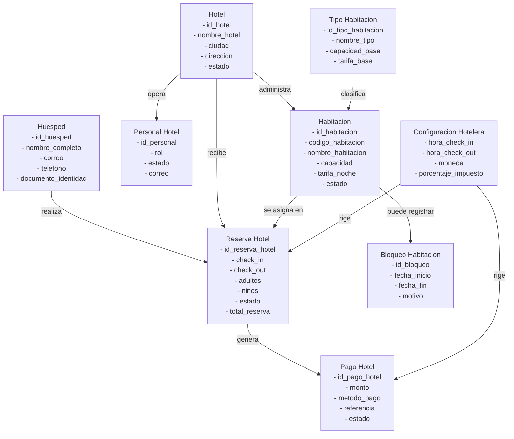
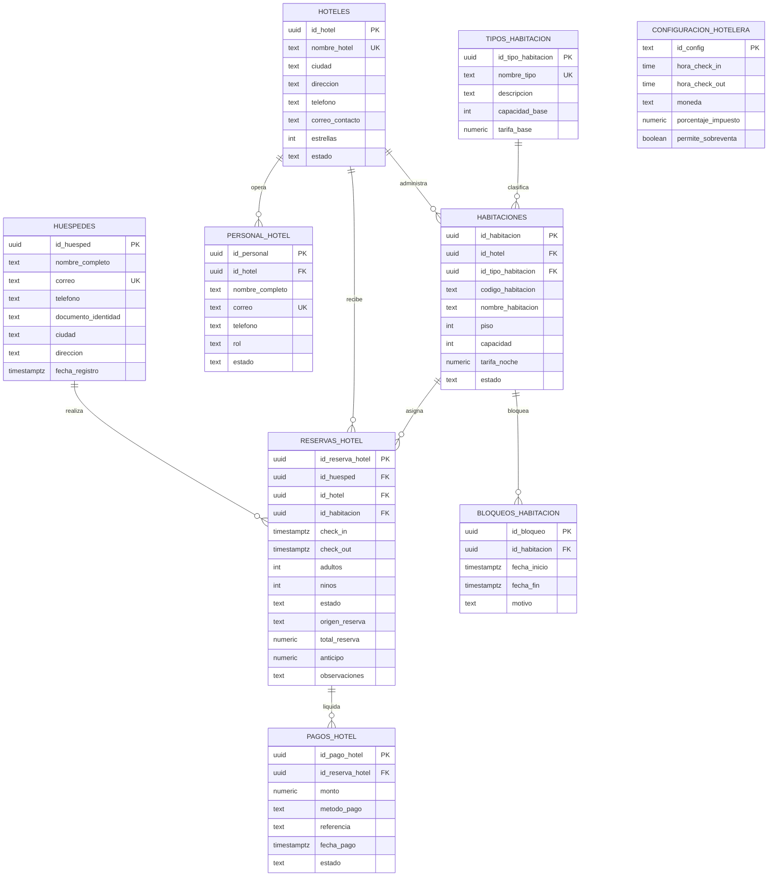

# Hotel Verona Modelos

Documento de referencia del dominio hotelero actual. Los diagramas reflejan la operacion del sistema despues de retirar el modelo de gimnasio, membresias y roles cliente/entrenador del flujo activo.

## Modelo Conceptual

## Modelo Logico

## Observaciones de diseño

- El huesped es la entidad principal de relacion comercial y reemplaza el antiguo concepto de cliente.
- Las reservas se gestionan contra inventario fisico de habitaciones, no contra programaciones de actividades.
- Los pagos siempre se registran contra una reserva hotelera; no existen membresias activas en el modelo actual.
- El personal hotelero se administra por hotel y sirve como base operativa para recepcion, gerencia, limpieza, soporte y administracion.
- La configuracion hotelera centraliza horarios operativos, moneda, impuestos y politica de sobreventa.